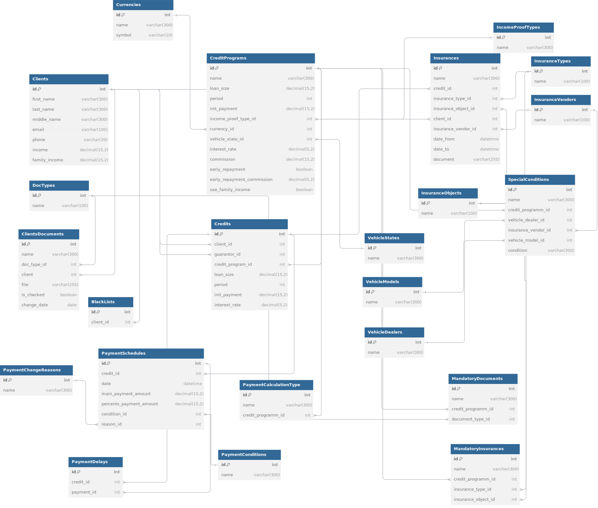

# Схема:


Файл схемы для dbdiagramm - schema.dbml

# Как запустить проект:
1) Клонируем проект к себе
2) Создаем в директории с docker-compose.yml файл .env со следующим содержимым:
```commandline
SQL_ENGINE=django.db.backends.postgresql
SQL_DATABASE=postgres
SQL_USER=postgres
SQL_PASSWORD=Prud3r@shlaffers
SQL_HOST=pgdb
SQL_PORT=5432
POSTGRES_HOST=pgdb
POSTGRES_NAME=postgres
POSTGRES_USER=postgres
POSTGRES_PASSWORD=Prud3r@shlaffers
POSTGRES_PORT=5432
```
3) Создаем в директории с docker-compose.yml файл .env.db со следующим содержимым:
```commandline
POSTGRES_HOST=localhost
POSTGRES_USER=postgres
POSTGRES_PASSWORD=Prud3r@shlaffers
POSTGRES_DB=postgres
POSTGRES_PORT=5432
```
4) cd в директорию с проектом
5) В директории, где лежит docker-compose файл выполняем команду ```docker-compose up --build```
6) Ждем сборку проекта
7) Когда проект собрался, нужно создать админа (чтобы просматривать таблицы в админке)
Вводим ```docker exec -it django bash```
8) Попадаем в окружение Python, вводим ```cd server```
9) Вводим ```python manage.py createsuperuser``` и следуем инструкциям

Как только суперюзер создан, проект можно открыть по адресу ```http://127.0.0.1:8000/```
Админка будет доступна по адресу ```http://127.0.0.1:8000/admin```

# Особенности:
- Модели бд лежат по пути ./server/app/models.py
- Миграции к моделям лежат по пути /.server/app/migrations
- При сборке проекта фреймворк автоматически выполнит все миграции, которые будут релевантны командам:
```commandline
CREATE TABLE clients (
    id SERIAL PRIMARY KEY,
    first_name VARCHAR(300) NOT NULL,
    last_name VARCHAR(300) NOT NULL,
    middle_name VARCHAR(300) NOT NULL,
    email VARCHAR(100) NOT NULL,
    phone VARCHAR(20) NOT NULL,
    income NUMERIC(15, 2) NOT NULL,
    family_income NUMERIC(15, 2) NOT NULL
);

CREATE TABLE doc_types (
    id SERIAL PRIMARY KEY,
    name VARCHAR(100) NOT NULL
);

CREATE TABLE insurance_types (
    id SERIAL PRIMARY KEY,
    name VARCHAR(100) NOT NULL
);

CREATE TABLE insurance_vendors (
    id SERIAL PRIMARY KEY,
    name VARCHAR(100) NOT NULL
);

CREATE TABLE insurance_objects (
    id SERIAL PRIMARY KEY,
    name VARCHAR(100) NOT NULL
);

CREATE TABLE currencies (
    id SERIAL PRIMARY KEY,
    name VARCHAR(300) NOT NULL,
    symbol VARCHAR(10) NOT NULL
);

CREATE TABLE vehicle_states (
    id SERIAL PRIMARY KEY,
    name VARCHAR(300) NOT NULL
);

CREATE TABLE vehicle_dealers (
    id SERIAL PRIMARY KEY,
    name VARCHAR(300) NOT NULL
);

CREATE TABLE vehicle_models (
    id SERIAL PRIMARY KEY,
    name VARCHAR(300) NOT NULL
);

CREATE TABLE income_proof_types (
    id SERIAL PRIMARY KEY,
    name VARCHAR(300) NOT NULL
);

CREATE TABLE payment_conditions (
    id SERIAL PRIMARY KEY,
    name VARCHAR(300) NOT NULL
);

CREATE TABLE payment_change_reasons (
    id SERIAL PRIMARY KEY,
    name VARCHAR(300) NOT NULL
);

-- Таблицы с внешними ключами (порядок важен)
CREATE TABLE credit_programs (
    id SERIAL PRIMARY KEY,
    name VARCHAR(300) NOT NULL,
    loan_size NUMERIC(15, 2) NOT NULL,
    period INTEGER NOT NULL,
    init_payment NUMERIC(15, 2) NOT NULL,
    income_proof_type_id INTEGER REFERENCES income_proof_types(id) ON DELETE SET NULL,
    currency_id INTEGER REFERENCES currencies(id) ON DELETE SET NULL,
    vehicle_state_id INTEGER REFERENCES vehicle_states(id) ON DELETE SET NULL,
    interest_rate NUMERIC(5, 2) NOT NULL,
    commission NUMERIC(15, 2) NOT NULL,
    early_repayment BOOLEAN NOT NULL DEFAULT false,
    early_repayment_commission NUMERIC(5, 2),
    use_family_income BOOLEAN NOT NULL DEFAULT false
);

CREATE TABLE clients_documents (
    id SERIAL PRIMARY KEY,
    name VARCHAR(300) NOT NULL,
    doc_type_id INTEGER REFERENCES doc_types(id) ON DELETE SET NULL,
    client_id INTEGER REFERENCES clients(id) ON DELETE SET NULL,
    file VARCHAR(100) NOT NULL,
    is_checked BOOLEAN NOT NULL DEFAULT false,
    change_date DATE NOT NULL
);

CREATE TABLE payment_calculation_type (
    id SERIAL PRIMARY KEY,
    name VARCHAR(300) NOT NULL,
    credit_programm_id INTEGER REFERENCES credit_programs(id) ON DELETE SET NULL
);

CREATE TABLE special_conditions (
    id SERIAL PRIMARY KEY,
    name VARCHAR(300) NOT NULL,
    credit_programm_id INTEGER REFERENCES credit_programs(id) ON DELETE SET NULL,
    vehicle_dealer_id INTEGER REFERENCES vehicle_dealers(id) ON DELETE SET NULL,
    insurance_vendor_id INTEGER REFERENCES insurance_vendors(id) ON DELETE SET NULL,
    vehicle_model_id INTEGER REFERENCES vehicle_models(id) ON DELETE SET NULL,
    condition VARCHAR(300) NOT NULL
);

CREATE TABLE mandatory_documents (
    id SERIAL PRIMARY KEY,
    name VARCHAR(300) NOT NULL,
    credit_programm_id INTEGER REFERENCES credit_programs(id) ON DELETE SET NULL,
    document_type_id INTEGER REFERENCES doc_types(id) ON DELETE SET NULL
);

CREATE TABLE mandatory_insurances (
    id SERIAL PRIMARY KEY,
    name VARCHAR(300) NOT NULL,
    credit_programm_id INTEGER REFERENCES credit_programs(id) ON DELETE SET NULL,
    insurance_type_id INTEGER REFERENCES insurance_types(id) ON DELETE SET NULL,
    insurance_object_id INTEGER REFERENCES insurance_objects(id) ON DELETE SET NULL
);

CREATE TABLE credits (
    id SERIAL PRIMARY KEY,
    client_id INTEGER REFERENCES clients(id) ON DELETE SET NULL,
    guarantor_id INTEGER REFERENCES clients(id) ON DELETE SET NULL,
    credit_program_id INTEGER REFERENCES credit_programs(id) ON DELETE SET NULL,
    loan_size NUMERIC(15, 2) NOT NULL,
    period INTEGER NOT NULL,
    init_payment NUMERIC(15, 2) NOT NULL,
    interest_rate NUMERIC(5, 2) NOT NULL
);

CREATE TABLE insurances (
    id SERIAL PRIMARY KEY,
    name VARCHAR(300) NOT NULL,
    credit_id INTEGER REFERENCES credits(id) ON DELETE SET NULL,
    insurance_type_id INTEGER REFERENCES insurance_types(id) ON DELETE SET NULL,
    insurance_object_id INTEGER REFERENCES insurance_objects(id) ON DELETE SET NULL,
    client_id INTEGER REFERENCES clients(id) ON DELETE SET NULL,
    insurance_vendor_id INTEGER REFERENCES insurance_vendors(id) ON DELETE SET NULL,
    date_from TIMESTAMP NOT NULL,
    date_to TIMESTAMP NOT NULL,
    document VARCHAR(100) NOT NULL
);

CREATE TABLE payment_schedules (
    id SERIAL PRIMARY KEY,
    credit_id INTEGER REFERENCES credits(id) ON DELETE SET NULL,
    date TIMESTAMP NOT NULL,
    main_payment_amount NUMERIC(15, 2) NOT NULL,
    percents_payment_amount NUMERIC(15, 2) NOT NULL,
    condition_id INTEGER REFERENCES payment_conditions(id) ON DELETE SET NULL,
    reason_id INTEGER REFERENCES payment_change_reasons(id) ON DELETE SET NULL
);

CREATE TABLE payment_delays (
    id SERIAL PRIMARY KEY,
    credit_id INTEGER REFERENCES credits(id) ON DELETE SET NULL,
    payment_id INTEGER REFERENCES payment_schedules(id) ON DELETE SET NULL
);

CREATE TABLE black_lists (
    id SERIAL PRIMARY KEY,
    client_id INTEGER REFERENCES clients(id) ON DELETE SET NULL
);
```

# Примеры запросов:
1) Подбор кредитной программы (Запрос через фронт приложения):
```commandline
SELECT cp.*
FROM app_creditprograms cp
WHERE
    (
        (cp.use_family_income = FALSE AND 
        (SELECT income FROM app_clients WHERE id = 1) >= cp.loan_size)
        OR
        (cp.use_family_income = TRUE AND 
        (SELECT family_income FROM app_clients WHERE id = 1) >= cp.loan_size)
    )
    AND
    NOT EXISTS (
        SELECT 1
        FROM app_mandatorydocuments md
        WHERE md.credit_programm_id = cp.id
        AND NOT EXISTS (
            SELECT 1
            FROM app_clientsdocuments cd
            WHERE cd.client_id = 1
                AND cd.doc_type_id = md.document_type_id
                AND cd.is_checked = TRUE
        )
    )
ORDER BY 
    cp.interest_rate ASC,
    cp.commission ASC
LIMIT 5;
```
2) Клиент с просрочками и в черном списке:
```commandline
SELECT 
    c.*,
    COUNT(pd.id) AS total_delays,
    MAX(ps.date) AS last_delay_date
FROM app_clients c
JOIN app_credits cr ON c.id = cr.client_id
JOIN app_paymentdelays pd ON cr.id = pd.credit_id
JOIN app_paymentschedules ps ON pd.payment_id = ps.id
WHERE
    c.id IN (SELECT client_id FROM app_blacklists)
    AND ps.date < CURRENT_DATE
GROUP BY c.id
HAVING COUNT(pd.id) > 3
ORDER BY total_delays DESC;
```
